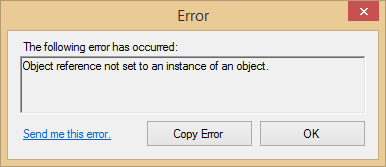
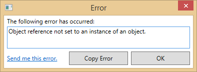

# CSharp-ErrorForm
ErrorForm is a custom error form with a website link and copy button, made to replace the usual method of displaying errors to the user.

 

## How to Use
Make a new WinForms or WPF project in Visual Studio and include a reference to ErrorForm.dll. Create a new ErrorForm instance and use try/catch blocks to send an exception to the ErrorForm using ShowDialog(Exception). For an example, try the ErrorFormTest and ErrorFormWPFTest projects.

### Properties of ErrorForm
* **WebsiteLink** - Typically your website link. Clicking on the link in the error form should send a user to your webpage. If your website uses PHP, you can also use $_GET to automatically fill a contact form.
* **ErrorLabelText** - The text displayed above the error textbox. (*Default*: "The following error has occurred:")
* **SendLinkText** - The text displayed for your website link. (*Default*: "Send me this error.")
* **SendLinkEnabled** - Whether to show or hide the website link. If **WebsiteLink** is null or empty, **SendLinkEnabled** will automatically be *false*.

## Install via NuGet
You can install via NuGet by either installing through Visual Studio or running one of these commands:
    PM> Install-Package ErrorForm
    PM> Install-Package ErrorFormWPF
